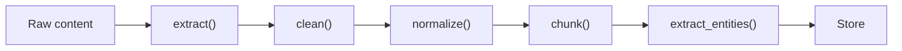
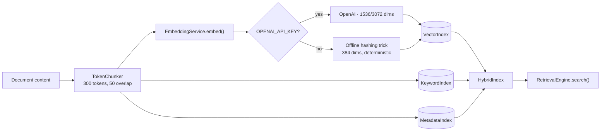
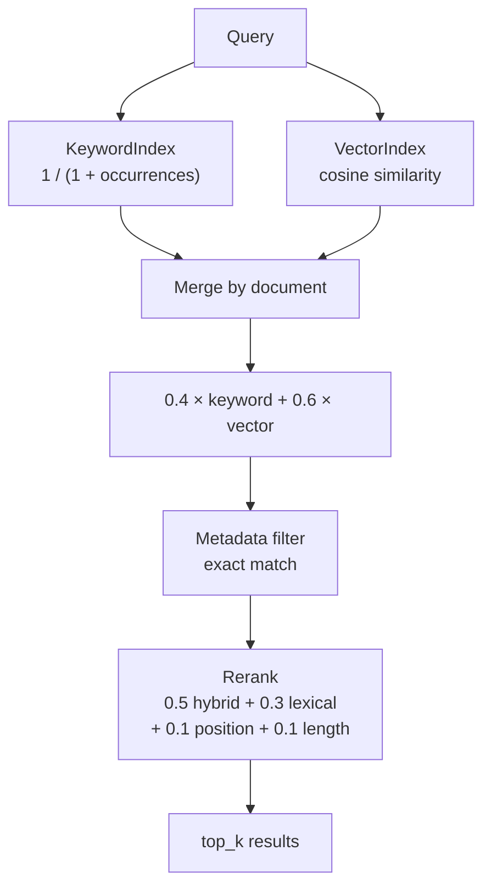
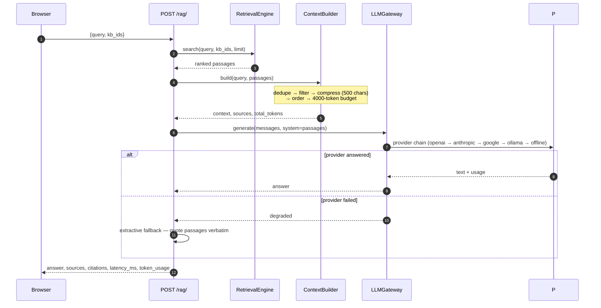

# Data Processing

## Full Pipeline: Extract → Clean → Normalize → Chunk → Entities

## Data Extract

`TextProcessor.extract(content, source_type)` dispatches by source type:

| Source | Method | What it does |
|---|---|---|
| `web` | `_extract_web()` | Strips HTML tags via regex `<[^>]+>`, collapses whitespace |
| `pdf` | `_extract_pdf()` | **Placeholder** — returns content as-is |
| `file` | `_extract_file()` | Returns content as-is |

## Data Clean

`TextProcessor.clean(text)` — two regex passes:

1. `re.sub(r'\s+', ' ', text)` — collapse all whitespace to single spaces
2. `re.sub(r'[^\w\s.,;:!?()\-\'\"{}[\]]', '', text)` — strip everything except word chars, digits, punctuation, quotes, brackets, braces

## Data Normalize

`TextProcessor.normalize(text)` — lowercase + strip. Applied **after** clean, so chunking and entity extraction run on lowercased text.

## Data Chunk

`Chunker.chunk(text)` — sliding window over characters:

- **Size:** 800 chars, **Overlap:** 100 chars
- Each chunk carries: `content`, `chunk_index`, `start_char`, `end_char`, `token_count` (whitespace split count)
- Identity is **positional only** — `chunk_index` resets per document, not stable across re-indexing

## Data Entities

`EntityExtractor.extract(text)` — naive regex over first 1000 chars:

- Splits on whitespace, flags words starting with uppercase and length > 2
- Type is always `"UNKNOWN"` — **no NER model wired up** (spaCy/BERT noted as placeholder)

## Index Path: TokenChunker

`TokenChunker` (`services/chunking.py`) — token-aware, used by the indexing task:

- **Size:** 300 tokens, **Overlap:** 50 tokens
- `TOKEN_RE = r"\S+"` — tokens are whitespace-delimited non-space runs
- Stable `chunk_id = f"{document_id}:{index}"` — survives re-indexing
- Carries: `chunk_id`, `content`, `metadata`, `token_count`, `chunk_index`, `start_char`, `end_char`

## Hybrid Index → Search

## Hybrid Search Scoring

## RAG Answer Pipeline

## Current Limitations

- **Upload stores chunks, but nothing indexes them** — uploaded documents can't be searched
- **PDF extraction is a placeholder** — returns raw content as-is
- **Entity extraction is naive regex** — type is always `"UNKNOWN"`, no NER model
- **Qdrant/Elasticsearch** health-probed only; vector search is a numpy scan, keyword is term counting
- **`kb_ids` and `score_threshold`** accepted but ignored by the retrieval engine
- **Cross-process visibility** — `hybrid_index` is per-process; API and worker are separate containers
- **`chunks`, `entities`, `relationships`** tables declared in models but never written